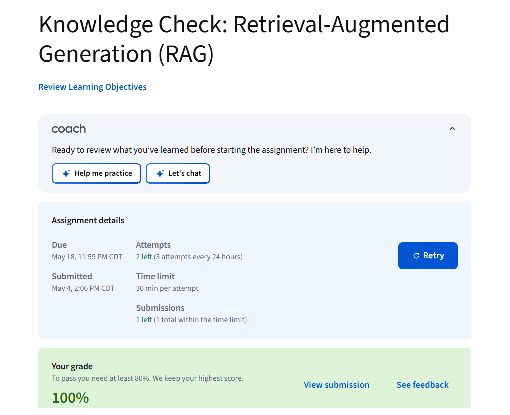
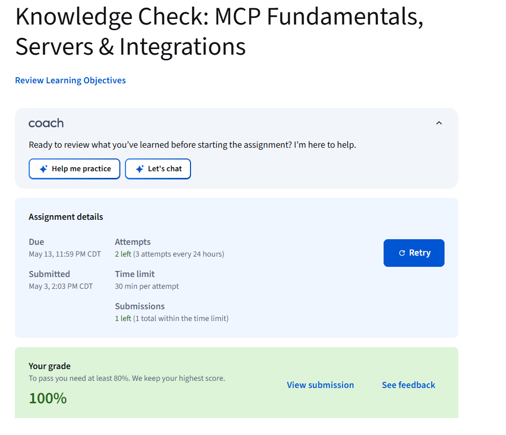
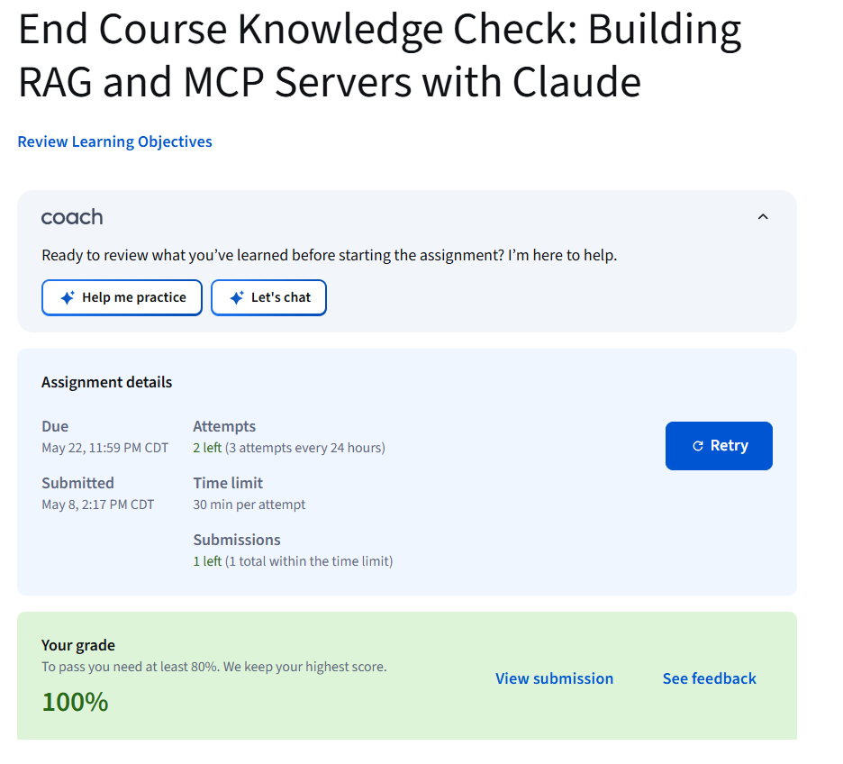
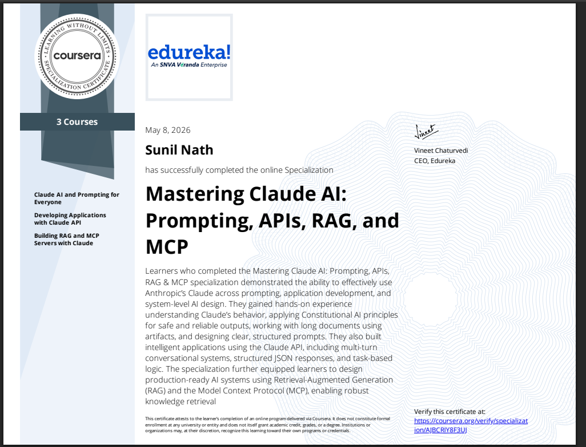

# Final Project

This repository contains the final project deliverables and implementation work.

## Tutorial 3 Deliverables

- [x] Complete required module: RAG with Claude
- [x] Complete required module: MCP Integration
- [x] Complete required module: Agent SDK
- [x] Capture screenshot evidence for each required module
- [x] Write architecture proposal in architecture.md
- [x] Build one proof of concept component
- [x] Document proof of concept in poc-notes.md
- [x] Add, commit, and push changes to GitHub

## Files

- tutorial3-checklist.md: Step-by-step checklist for Tutorial 3
- architecture.md: One-page architecture proposal with system diagram
- poc-notes.md: Brief proof-of-concept report
- evidence/screenshots/: Screenshot evidence

## Tutorial 3 Evidence Screenshots

### RAG Module (100%)

### MCP Integration Module (100%)

### Agent SDK / End Course Module (100%)

### Specialization Certificate

## Current Status

- Completed: proposal.md, architecture.md, poc-notes.md, checklist setup, and Tutorial 3 screenshot evidence.
- Remaining: submit final GitHub link via Gradescope.

## Suggested Commit Sequence

1. `docs: add tutorial 3 checklist and architecture draft`
2. `feat: add poc component with tests`
3. `docs: add poc notes and module screenshot evidence`
