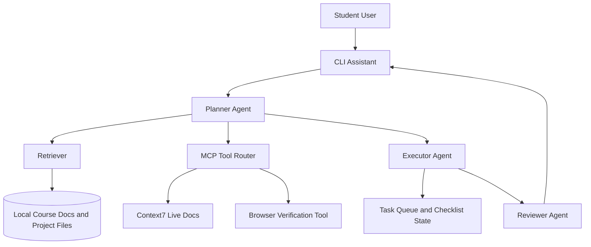

# Architecture Proposal: StudyFlow Coach

## 1. Project Overview

- Project name: StudyFlow Coach
- Problem statement: Students lose time switching between assignment docs, checklists, and tool outputs, which causes missed requirements and rushed submissions.
- Target users: Students managing multiple AI engineering assignments and project deliverables.
- Success outcome: A user can enter an assignment brief and receive a grounded action plan, progress checklist, and next-step recommendations in one place.

## 2. Scope

In scope:
- Parse assignment prompts and extract required deliverables.
- Retrieve project-relevant context from local course notes and project docs.
- Use tool integrations for live documentation checks and browser verification evidence.
- Generate a weekly execution plan with milestone tracking.

Out of scope:
- Full LMS integration (Canvas/Gradescope API automation).
- Multi-user authentication and shared team workspaces.

## 3. Chosen Patterns

This design uses all three Tutorial 3 patterns:

- [x] RAG
- [x] MCP
- [x] Agent SDK

## 4. System Diagram

> **MVP implementation scope.** The current code in `src/studyflow/` implements the CLI Assistant (`cli.py`), Planner (`planner.py`), Retriever (`retriever.py`), and Reviewer (`reviewer.py`), wired together by an orchestrator (`orchestrator.py`). The MCP Tool Router (`T → C7 / BR`) and standalone Executor Agent (`E`) are intentionally deferred — they remain optional extension points (see `poc-notes.md` §2 and `tutorial3-checklist.md` "Optional Stretch") so the core flow stays runnable offline.

## 5. Pattern Details

### Pattern A: RAG

- Why this pattern fits: Assignment instructions are long and change often; retrieval reduces missed requirements by grounding outputs in local source files.
- Connected data/services: Local markdown files, project README/spec files, and saved module notes.
- One anticipated risk: Irrelevant chunks can be ranked highly and pollute answers.
- Mitigation: Add metadata filters (course/week/tag) and return top-k sources with citation display.

### Pattern B: MCP

- Why this pattern fits: Live docs and browser checks reduce API guesswork and improve evidence quality.
- Connected data/services: Context7 for version-aware docs and browser tool for visual verification screenshots.
- One anticipated risk: External tool downtime or rate limits can block workflow.
- Mitigation: Implement graceful fallback to cached notes plus retry and timeout handling.

### Pattern C: Agent SDK

- Why this pattern fits: Splitting work into planner, executor, and reviewer roles improves reliability on multi-step assignment tasks.
- Connected data/services: Planner consumes retrieved context, executor performs tool calls, reviewer checks rubric alignment.
- One anticipated risk: Extra orchestration can increase latency.
- Mitigation: Use a lightweight mode for small tasks and full multi-agent mode only for complex requests.

## 6. Request Flow

1. User submits an assignment prompt or asks for next actions.
2. Planner agent classifies the request (quick task vs. multi-step task).
3. Retriever fetches relevant local context and prior notes.
4. Executor optionally calls MCP tools for live docs or verification.
5. Reviewer checks output against rubric items and missing requirements.
6. System returns final checklist, timeline, and evidence suggestions.

## 7. Concrete MVP Modules

The first implementation will use four modules only:

- `retriever`: load local markdown docs, split into chunks, and return top-k relevant chunks.
- `planner`: generate a minimum 5-step checklist and attach citations.
- `reviewer`: validate plan quality (actionability, coverage, fallback correctness).
- `cli`: single command entrypoint that runs retriever -> planner -> reviewer.

MVP command contract:
- Input: one prompt string.
- Output: checklist + citations + risk notes + fallback guidance when context is weak.

MCP usage in MVP:
- Optional verification/tool step through executor path.
- If unavailable, planner flow still succeeds with local retrieval.

## 8. Risks and Constraints

- Risk 1: Hallucinated API usage when live docs are unavailable.
- Risk 2: Over-scoped plans that are hard to finish before deadlines.
- Constraint 1: Project must remain demoable on a local machine with minimal setup.

## 9. Validation Plan

- Unit tests:
    - retriever relevance ranking and empty-context behavior
    - planner checklist length and citation presence
    - reviewer validation and fallback checks
- Integration tests:
    - cli end-to-end flow (retriever -> planner -> reviewer)
    - optional MCP call path with graceful fallback
- Manual demo checklist:
    - one Tutorial 3 prompt run
    - one Wiredup prompt run
    - one hallucination comparison scenario

## 10. Milestones

- Milestone 1: Complete module notes and screenshot evidence.
- Milestone 2: Finish architecture proposal and diagram.
- Milestone 3: Build one working POC component (retrieval plus planning output).
- Milestone 4: Polish docs, run tests, and submit repo link.
